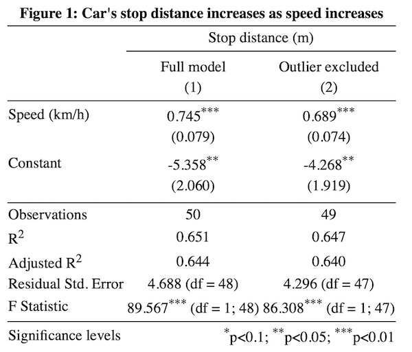
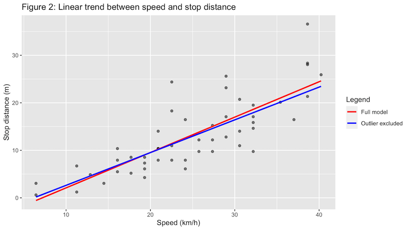

# Regression Analysis

*In this building block, we analyze the relationship between a car's speed and the stop distance. First, we check the model assumptions and screen for potential outliers. Second, we export our regression results into a format that you can easily copy into word processing software. Third, we build a scatter plot with the trend line on top of it. Fourth and last, we make predictions for unseen data points.*

## 1. Evaluate Model Assumptions
We use the built-in `cars` dataset which includes 50 data points of a car's stop distance at a given speed. Since the dimensions are in miles per hour and foot, we first convert it into kilometer per hour and meter, respectively.

Then, we estimate a linear model and evaluate its properties with autoplot function from the `broom` package. Residuals indicate the difference between the predicted and the actual value. The left plot shows the residuals and the data points should center around the horizontal axis (i.e., the mean of the residuals is 0). Although the line goes a little downward around the middle, it does not look worrisome at first sight.

The second requirement is that the residuals are approximately normally distributed. This means that if you would plot the distribution of all residuals it would look like a bell-shaped distribution (also known as Gaussian distribution). This is the case if the data points in the QQ-Plot are close to the diagonal. In the second plot, we find that record 23, 35, and 49 are somewhat higher than expected (the right tail).


Finally, the right chart shows the standardized residuals for all fitted values. The homoskedasticity assumption states that the error term should be the same across all values of the independent variables. Hence, we should check here if there is any pattern that stands out. In our case, this happens to be the case as the blue line stays rather flat. It would, however, be troublesome if the error value increases for higher speed values.

*Code snippet*
```
library(ggplot2)
library(ggfortify)
library(broom)
library(dplyr)

data(cars) # import built-in car dataset
cars$speed_kmh <- cars$speed * 1.60934  # convert miles per hour to kilometer per hour
cars$dist_m <- cars$dist * 0.3048  # convert foot to meters

# estimate linear model
mdl_cars <- lm(dist_m ~ speed_kmh, data=cars)

# check linear model assumptions
autoplot(
  mdl_cars,
  which = 1:3,
  nrow = 1,
  ncol = 3
)
```

*Output*


---

## 2. Outlier Screening
Two measures used to identify outliers are leverage and influence. High leverage means that the explanatory variable has values that are different from other points in the dataset. In the case of simple linear regression, this typically indicates values with a very high or very low explanatory value. Influence measures how much a model would change if each observation was left out of the model calculations, one at a time. That is, it measures how different the prediction line would look if you run a linear regression on all data points except that point, compared to running a linear regression on the whole dataset. The standard metric for influence is Cook's distance, which calculates the influence based on the size of the residual and the leverage of the point.

We use the `augment` function from the `broom` package to obtain model fit statistics such as the `hat` and `cooksd` columns for the leverage and Cook's distance respectively. Not surprisingly, the data point with the highest influence (record 49) is the one that showed up earlier. To illustrate the impact of this data point, we can exclude it from our analysis and estimate another linear model. As you can see below, our model coefficients are remarkably different - by leaving out just a single data point! In other words, be extremely careful with outliers and in doubt always report your regression estimates with and without them.

*Code snippet*

```
leverage_influence <- mdl_cars %>%
    augment() %>%
    select(speed_kmh, dist_m, leverage = .hat, cooks_dist = .cooksd) %>%
    arrange(desc(cooks_dist)) %>%
    head()
```

*Output*

| `speed_kmh` | `dist_m` | `leverage` | `cooks_dist` |
| :--- | :--- | :--- | :--- |
| 38.6  | 36.6  | 0.0740  | 0.340   |
| 22.5 | 24.4  | 0.0214 | 0.0856  |
| 32.2  | 9.75 | 0.0354 | 0.0681  |
| 37.0  | 16.5 | 0.0622 | 0.0532 |
| 29.0 | 25.6  | 0.0249  | 0.0526  |
| 38.6 | 28.3 | 0.0740 | 0.0479  |

---

## 3. Model Reporting

Although the model output from the `summary()` command suffices for your own analysis, it is not exactly in the format you typically find in a journal publication. Fortunately, the `stargazer` package can export multiple model coefficients and fit statistics into a well-formatted HTML file that can be copy-pasted into Word while still being editable.

*Code snippet*

```
library(stargazer)

stargazer(mdl_cars, mdl_cars_cleaned,
          title = "Figure 1: Car's stop distance increases as speed increases",
          dep.var.caption = "Stop distance (m)",  
          dep.var.labels = "",  
          covariate.labels = c("Speed (km/h)"),  
          column.labels = c("Full model", "Outlier excluded"),
          notes.label = "Significance levels",  
          type="html",
          out="output.html"  
          )
```

*Output*



---

## 4. Visualize Linear Relationships
The most important relationships of a model are usually visualized to help the reader grasp the analysis. In this case, you may want to illustrate that the outlier severely impacts the regression slope, yet the direction of the relationship is consistent for both plots, and therefore the reader can be confident that there is indeed a strong positive relationship between car speed and the stop distance.

The `ggplot` library is based on the notion of visual layers. For example, we first create a scatter plot (`geom_point()`) after which we add a blue and a red trendline (`geom_smooth()`). Thereafter, we add the axis labels (`labs`), plot title (`ggtitle`), and a legend (`scale_colour_manual`).

*Code snippet*

```
library(ggplot2)

ggplot(cars, aes(speed_kmh, dist_m)) +
  geom_point(alpha = 0.5) +  
  geom_smooth(method = "lm", se = FALSE, aes(color="Full model")) +
  geom_smooth(method = "lm", se = FALSE, data = cars_cleaned,  aes(color="Outlier excluded"))  +
  labs(x = "Speed (km/h)", y = "Stop distance (m)") +  
  ggtitle("Figure 2: Linear trend between speed and stop distance") +
  scale_colour_manual(name="Legend", values=c("red", "blue"))
```

*Output*



---

## 5. Make Predictions for New Data
Although we should be careful to extrapolate outside the ranges of our data, we may be interested in the stop distance of a car that drives 45, 50 and 60 kilometers per hour. Then, we can create a data frame with these input values and make predictions with our linear model. In essence, this is simply plugging in the input values into the regression equation (`-5.358 + 0.745 * input_value`).

*Code snippet*

```
library(dplyr)
explanatory_data <- data.frame(speed_kmh=c(45, 50, 60))

prediction_data <- explanatory_data %>%
  mutate(
    dist_m = predict(
      mdl_cars, explanatory_data
    )
  )
```

*Output*

| speed_kmh | dist_m |
| :---- | :---- |
| 45  | 28.15682  |  
| 50  | 31.88070  |
| 60  | 39.32847  |


<!--
# Tutorial: Regression Analysis

## Prerequisites
* ...

## Learning goals

* Build linear and logistic regression models with multiple explanatory variables
* Make inferential claims about models using least square estimation
* Quantify uncertainty with confidence intervals
* Examine the impact of categorical data and interactions

## Data Challenge
- View the [Regression Analysis - Data Challenge](regression-analysis.html)
- Download the zip [file](regression-analysis-skeleton.zip). Then, open the skeleton file in RStudio, fill out your answers, and submit your work!!
-->
